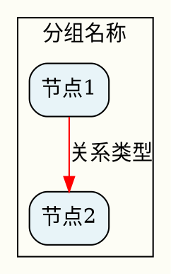

# Research to Diagram

深度调研主题并自动生成知识关系图谱PDF。从研究到可视化的一站式工具。

## Description

这个 Skill 接收用户提供的研究主题，自动进行深度网络调研、信息收集、知识整理、结构设计，最终生成专业的可视化关系图谱PDF。与 `structure-to-pdf` 不同，本 Skill 专注于**主动研究和知识挖掘**，而非被动的数据转换。

## 核心特性

- **自动调研**：使用 WebSearch 进行多轮深度调研
- **智能整理**：自动提取、分类、结构化信息
- **专业设计**：根据主题特点选择最佳可视化方案
- **多种输出**：支持 Graphviz、PlantUML、Mermaid 等工具
- **高质量PDF**：生成矢量图形，可无限缩放

## Trigger Conditions

当用户想要：
- 研究某个复杂主题的知识结构（如"红楼梦人物关系"）
- 生成人物关系图、概念图谱、知识图谱
- 理解某个领域的组织架构、技术架构
- 可视化复杂的关系网络
- 需要从零开始研究并可视化某个主题

**关键词**：
- 通用："调研...并做图"、"研究...的关系"、"深度分析...并可视化"、"生成...知识图谱"、"画...关系图"（无现成数据）
- 人物关系图："人物关系图"、"家族谱系"、"组织架构"
- 概念图谱："概念图谱"、"知识图谱"、"思维导图"
- 时间线图谱："时间线"、"历史演进"、"事件发展"、"...发展历程"
- 流程图谱："流程图"、"业务流程"、"操作流程"、"步骤流程"
- 对比图谱："对比图"、"竞品对比"、"差异分析"、"...对比"
- 层级图谱："层级图"、"组织架构"、"架构图"、"金字塔"
- 网络图谱："关系网络"、"网络图"、"连接图"

## Workflow

### Step 0: 图谱类型判断

首先判断用户需要生成哪种类型的图谱：

| 图谱类型 | 核心特征 | 典型场景 |
|----------|----------|----------|
| **人物关系图** | 人物/实体之间的社会/血缘关系 | 红楼梦人物、三国人物、企业高管 |
| **概念图谱** | 概念之间的逻辑/包含关系 | 知识体系、技术概念 |
| **时间线图谱** | 按时间顺序排列的事件/阶段 | 历史演进、发展历程 |
| **流程图谱** | 步骤/阶段之间的顺序关系 | 业务流程、操作步骤 |
| **对比图谱** | 多方并排对比 | 竞品分析、方案对比 |
| **层级图谱** | 上下级/包含关系 | 组织架构、分类体系 |
| **网络图谱** | 复杂的网状关系 | 知识图谱、社交网络 |
| **技术架构** | 系统组件及依赖 | 架构设计、技术栈 |

**类型识别规则**：

- 人物关系图：包含"人物"、"关系"、"家族"、"组织"等词
- 概念图谱：包含"概念"、"知识"、"思维导图"等词
- 时间线图谱：包含"时间线"、"发展历程"、"演进"、"历史"等词
- 流程图谱：包含"流程"、"步骤"、"操作"等词
- 对比图谱：包含"对比"、"差异"、"竞品"等词
- 层级图谱：包含"层级"、"架构"、"金字塔"等词
- 网络图谱：包含"网络"、"关系图谱"、"连接"等词
- 技术架构：包含"架构"、"组件"、"依赖"、"系统"等词

### 1. 任务规划（TodoWrite）
```
- 深度调研主题和相关知识
- 设计图谱结构和层次
- 创建可视化图表
- 生成PDF文档
```

### 2. 深度调研阶段
- **多轮 WebSearch**：从不同角度收集信息
  - 主题概述和背景
  - 核心要素和人物/概念
  - 关系和联系
  - 层次和分类
- **信息源记录**：保存所有参考资料链接
- **知识提取**：识别关键实体和关系

### 3. 结构设计阶段
根据图谱类型选择最佳结构：

**人物关系图**：
- 家族谱系：多层次树状结构（rankdir=TB）
- 社会网络：网状关系图（splines=curved）
- 组织架构：层次化布局（splines=ortho）

**概念图谱**：
- 知识分类：树状或思维导图（rankdir=TB）
- 概念关系：有向图（digraph）
- 流程图：线性或分支流程（rankdir=LR）

**时间线图谱**：
- 历史演进：横向时间轴（rankdir=LR）
- 事件发展：线性时间序列
- 分支演进：多线索时间线

**流程图谱**：
- 业务流程：泳道图或流程图
- 操作流程：步骤化流程（rankdir=TB/LR）
- 决策流程：分支流程图

**对比图谱**：
- 竞品对比：左右分栏对比
- 差异分析：矩阵式对比
- 特性对比：属性对比表

**层级图谱**：
- 组织架构：金字塔结构
- 层级关系：树状结构
- 分类体系：层次分类

**技术架构**：
- 系统组件：模块化布局
- 依赖关系：层次或网络图
- 数据流向：流程图

**网络图谱**：
- 关系网络：网状关系图
- 知识图谱：实体-关系图
- 社交网络：社交图谱

### 4. 可视化实现

优先使用 **Graphviz** (DOT 语言)：


**备选工具**：
- PlantUML：UML 图、时序图
- Mermaid：简单流程图、时序图

### 5. PDF 生成
```bash
dot -Tpdf diagram.dot -o output.pdf
```

### 6. 文档整理
可选生成说明文档，包含：
- 研究主题概述
- 图谱说明
- 参考资料来源（Sources）
- 使用说明

## 设计原则

### 视觉设计
1. **颜色编码**：使用不同颜色区分类别
2. **形状区分**：不同类型实体用不同形状
3. **层次清晰**：使用 subgraph cluster 分组
4. **关系标注**：边的颜色、样式、标签表达关系类型
5. **中文支持**：使用 "Arial Unicode MS" 或系统中文字体

### 信息层次
1. **标题层**：主标题
2. **分组层**：主要类别/家族
3. **实体层**：具体人物/概念
4. **关系层**：连接和标注
5. **图例层**：说明符号含义

### 布局策略
- **rankdir=TB**：自上而下（家族树、组织架构）
- **rankdir=LR**：从左到右（流程图、时间线）
- **rankdir=BT**：自下而上（依赖图）
- **splines=ortho**：正交边（清晰的组织图）
- **splines=curved**：曲线边（美观的关系网）

## 输出文件

默认保存位置：`~/Downloads/` 或用户指定目录

生成文件：
- `<topic>_relations.dot` - Graphviz 源文件
- `<topic>_relations.pdf` - 最终PDF图谱
- `<topic>_sources.md` - 参考资料（可选）

## 使用示例

### 示例 1：文学作品人物关系
```
用户：深度调查《三国演义》里人物之间的关系，然后做个结构图 PDF
```

Skill 执行：
1. 调研三国主要人物、阵营、关系
2. 设计：魏蜀吴三大阵营 + 人物层次 + 联盟/对抗关系
3. 使用 Graphviz 创建多层次关系图
4. 生成 PDF

### 示例 2：技术概念图谱
```
用户：研究 Kubernetes 架构并生成可视化图谱
```

Skill 执行：
1. 调研 K8s 核心组件、架构层次
2. 设计：控制平面/数据平面/插件生态
3. 生成技术架构图
4. 输出 PDF

### 示例 3：历史事件关系
```
用户：分析二战主要国家和联盟关系，做成图表
```

Skill 执行：
1. 调研参战国家、阵营、关键时间节点
2. 设计：轴心国/同盟国/中立国关系网
3. 生成带时间线的关系图
4. 输出 PDF

## 与 structure-to-pdf 的区别

| 特性 | research-to-diagram | structure-to-pdf |
|------|---------------------|------------------|
| 输入 | 仅主题/研究问题 | 现成的结构化数据 |
| 调研 | ✅ 自动深度调研 | ❌ 无需调研 |
| 知识整理 | ✅ 自动提取和结构化 | ❌ 直接使用用户数据 |
| 应用场景 | 知识探索、研究可视化 | 快速数据转换 |
| 时间 | 较长（需调研） | 快速 |

**何时使用本 Skill**：
- ✅ 没有现成数据，需要从零研究
- ✅ 想要深度了解某个主题的知识结构
- ✅ 需要权威来源支持的可视化

**何时使用 structure-to-pdf**：
- ✅ 已有结构化数据
- ✅ 需要快速转换为图表
- ✅ 数据格式简单清晰

## 依赖工具

**必需**：
- Graphviz: `brew install graphviz` (macOS)
- WebSearch: Claude Code 内置

**可选**：
- PlantUML: `brew install plantuml`
- Mermaid CLI: `npm install -g @mermaid-js/mermaid-cli`

## 配置选项

用户可以通过参数自定义：
- `--tool`: 指定可视化工具 (graphviz/plantuml/mermaid)
- `--layout`: 指定布局方向 (TB/LR/BT/RL)
- `--output`: 指定输出目录
- `--depth`: 调研深度 (quick/medium/deep)
- `--sources`: 是否生成参考资料文档

## 最佳实践

1. **明确主题范围**：主题越具体，图谱越清晰
2. **合理分组**：使用 cluster 将相关实体分组
3. **控制复杂度**：单个图谱不超过 50 个节点
4. **渐进细化**：先生成总览图，再深入细节
5. **颜色一致**：同类实体使用相同配色
6. **标注来源**：在 PDF 底部或单独文档标注参考资料

**⚠️ 文字安全规范（防止语法错误）**：
- 避免 Unicode 特殊字符：`·` `-` `—` `"` `'` `：` 等
- 推荐写法：
  - ❌ `"哈利·波特"` → ✅ `"哈利波特"`
  - ❌ `"A → B"` → ✅ `"A -> B"`
  - ❌ `"测试: 结果"` → ✅ `"测试 - 结果"`
  - ❌ `"他说: \"你好\""` → ✅ `"他说: 你好"`
- 验证方法：生成前执行 `dot -Tdot file.dot` 检查语法

**⚠️ 命名安全规范**：
- 避免使用 DOT 保留字：`edge`、`node`、`graph`、`subgraph` 等
- 推荐写法：
  - ❌ `edge` → ✅ `edge_computing`
  - ❌ `node` → ✅ `nodejs`
  - ❌ `graph` → ✅ `graph_db`

**⚠️ 布局选择**：
- 人物关系/网络图：推荐 `splines=curved`，但注意边缘标签
- 组织架构/层级图：推荐 `splines=ortho`
- 流程图/时间线：推荐默认 `splines=spline`

## 常见图谱类型模板

### 人物关系图模板
```dot
- 家族/组织用 cluster 分组
- 人物用 box/ellipse，重要人物用特殊形状
- 血缘关系用实线，婚姻用红色，其他用虚线
- 添加图例说明符号含义
```

### 概念图谱模板
```dot
- 顶层概念在上方
- 子概念逐层展开
- is-a 关系用实线，has-a 用虚线
- 使用颜色区分不同类别
```

### 时间线图谱模板
```dot
- 使用 rankdir=LR 从左到右布局
- 时间节点用圆形或椭圆
- 事件用矩形描述
- 关键节点用特殊颜色标注
- 可使用 rank=same 强制同层
```

### 流程图谱模板
```dot
- 使用 rankdir=TB 或 LR
- 步骤用矩形或圆角矩形
- 判断用菱形
- 流程用箭头连接
- 使用子图分组相关步骤
```

### 对比图谱模板
```dot
- 使用 cluster 分组对比各方
- 对比项用表格形式
- 差异用不同颜色标注
- 相似处用相同颜色
- 添加小结节点汇总差异
```

### 层级图谱模板
```dot
- 使用 rankdir=TB 金字塔布局
- 层级用不同颜色区分
- 上下级用箭头连接
- 可用 cluster 分组同一层级
- 顶层节点突出显示
```

### 网络图谱模板
```dot
- 使用 splines=curved 曲线连接
- 节点用圆形或椭圆
- 关系强度用线条粗细表示
- 核心节点用大字号/特殊颜色
- 密集区域可用 cluster 分组
```

### 技术架构图模板
```dot
- 分层架构用 rankdir=TB
- 组件用矩形，服务用圆角矩形
- 依赖关系用箭头
- 关键路径用粗线或特殊颜色
```

## 故障排除

**中文显示乱码**：
```dot
graph [fontname="Arial Unicode MS"]
node [fontname="Arial Unicode MS"]
edge [fontname="Arial Unicode MS"]
```

**⚠️ 特殊字符问题**：
- **问题**：Unicode 特殊字符（如中间点 `·`、破折号 `—`、引号 `""`）可能导致 DOT 语法错误
- **解决**：
  - 避免使用 `·`（中间点），改用无点写法（如"哈利波特"而非"哈利·波特"）
  - 避免使用 `—`（长破折号），改用 `-` 或 `->`
  - 避免使用中文引号 `""`，改用英文引号 `""` 或不用引号
  - 避免使用 `:`（冒号）在 label 内容中，改用 `-` 或 `：`
- **验证**：生成 PDF 前先用 `dot -Tdot file.dot` 检查语法

**⚠️ 边缘标签不显示**：
- **问题**：使用 `splines=curved` 时，边缘标签（edge labels）可能不显示
- **解决**：
  - 方案1：改用 `splines=ortho`（正交边）代替 `splines=curved`
  - 方案2：使用 `xlabel` 代替 `label`（仅用于位置标注）
  - 方案3：使用 `splines=spline`（仅支持简单曲线）

**⚠️ DOT 保留字冲突**：
- **问题**：某些单词是 DOT 语言的保留字，使用作为节点名会导致语法错误
- **已知的保留字**：`edge`、`node`、`graph`、`digraph`、`subgraph`、`strict` 等
- **解决**：
  - 避免使用保留字作为节点名
  - 改用添加后缀的方式：如 `edge_computing`、`nodejs`、`graph_db`
- **验证**：生成 PDF 前先用 `dot -Tdot file.dot` 检查语法

**图谱过于复杂**：
- 使用 `concentrate=true` 合并相同边
- 分割成多个子图
- 使用不同的 rankdir

**布局不理想**：
- 调整 `ranksep` 和 `nodesep`
- 使用 `rank=same` 强制节点同层
- 尝试不同的 `splines` 设置

## 版本历史

- **v1.3** (2026-03-11): 复杂场景验证
  - 新增"DOT保留字冲突"故障排除：edge/node/graph等保留字处理
  - 验证测试：完成5个复杂场景验证
  - 验证类型：IoT生态网络、云计算对比、编程语言时间线、微服务架构、CI/CD流程

- **v1.2** (2026-03-11): 修复已知问题
  - 新增"特殊字符问题"故障排除：避免 Unicode 字符导致语法错误
  - 新增"边缘标签不显示"故障排除：splines=curved 时的替代方案
  - 验证测试：完成 6 种图谱类型测试验证

- **v1.1** (2026-03-11): 扩展图谱类型支持
  - 新增时间线图谱类型：支持历史演进、发展历程可视化
  - 新增流程图谱类型：支持业务流程、操作流程可视化
  - 新增对比图谱类型：支持竞品分析、差异分析可视化
  - 新增层级图谱类型：支持组织架构、分类体系可视化
  - 新增网络图谱类型：支持知识图谱、社交网络可视化
  - 新增图谱类型识别逻辑（Step 0）
  - 新增各类型设计模板
  - 来源：参考 deep-research 拓展经验

- **v1.0** (2026-01-02): 初始版本
  - 基于《红楼梦》人物关系图谱项目总结
  - 支持 Graphviz 自动生成
  - 集成 WebSearch 深度调研
  - TodoWrite 任务管理
